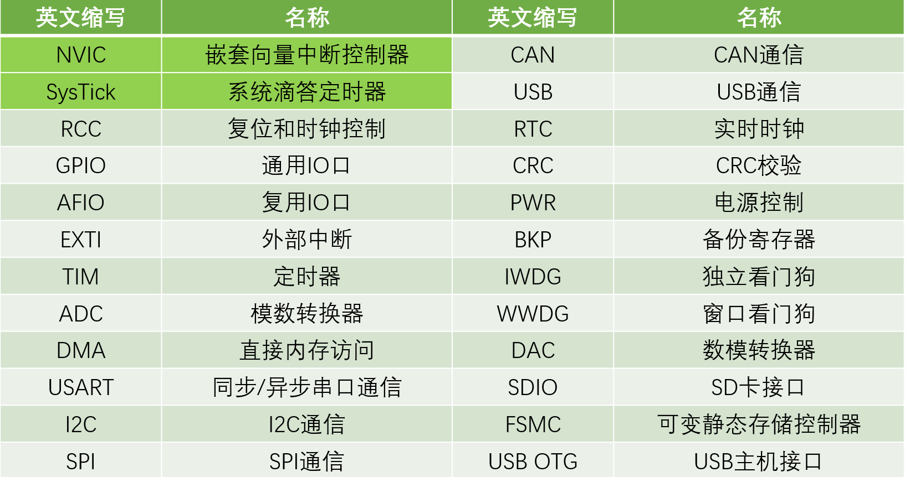
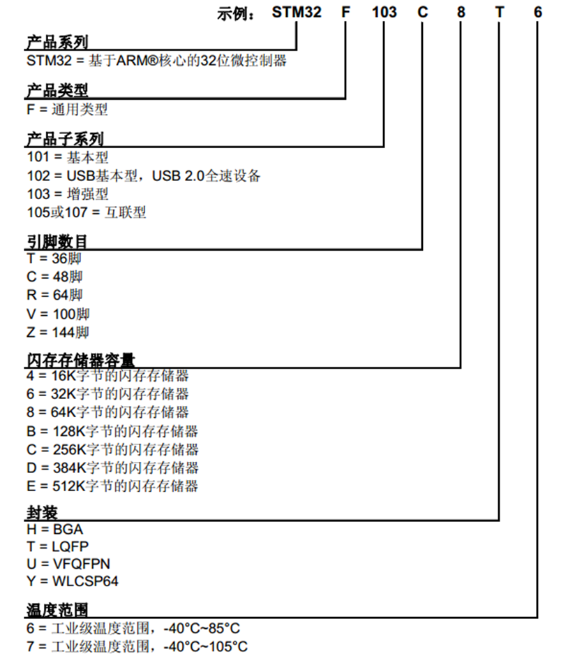

# STM32开发学习笔记

## **目录**
- [STM32开发学习笔记](#stm32开发学习笔记)
  - [**目录**](#目录)
  - [**简介**](#简介)
    - [开发所需知识](#开发所需知识)
    - [参考资料](#参考资料)
    - [目录结构](#目录结构)
    - [注意事项](#注意事项)
  - [**硬件单元**](#硬件单元)
  - [**STM32系列详细介绍**](#stm32系列详细介绍)
    - [主流型MCU](#主流型mcu)
    - [高性能MCU](#高性能mcu)
    - [超低功耗MCU](#超低功耗mcu)
    - [无线系列MCU](#无线系列mcu)
  - [**ARM处理器家族**](#arm处理器家族)
    - [Classic](#classic)
    - [Embedded](#embedded)
    - [Application](#application)
    - [选型建议](#选型建议)
  - [**STM32F103C8T6**](#stm32f103c8t6)
    - [1. 介绍](#1-介绍)
    - [2. 片上资源/外设](#2-片上资源外设)
    - [3. 命名规则](#3-命名规则)
    - [4. 系统结构](#4-系统结构)
      - [a. 核心部分（左上角）](#a-核心部分左上角)
        - [Cortex-M3内核及三条主要总线](#cortex-m3内核及三条主要总线)
      - [b. 总线系统](#b-总线系统)
        - [AHB总线（Advanced High-performance Bus）](#ahb总线advanced-high-performance-bus)
        - [APB总线（Advanced Peripheral Bus）](#apb总线advanced-peripheral-bus)
        - [桥接器](#桥接器)
      - [c. DMA系统（左下角）](#c-dma系统左下角)
        - [功能定位](#功能定位)
        - [工作机制](#工作机制)
        - [应用场景](#应用场景)
    - [5. 引脚定义](#5-引脚定义)
      - [引脚布局](#引脚布局)
      - [引脚类型说明](#引脚类型说明)
      - [电平容忍度](#电平容忍度)
      - [功能定义](#功能定义)
      - [引脚分类（按颜色标记）](#引脚分类按颜色标记)
        - [电源类引脚（红色）](#电源类引脚红色)
        - [最小系统引脚（蓝色）](#最小系统引脚蓝色)
        - [IO/功能引脚（绿色）](#io功能引脚绿色)
      - [使用注意事项](#使用注意事项)
    - [6. STM32启动配置](#6-stm32启动配置)
      - [启动配置（BOOT引脚）](#启动配置boot引脚)
        - [启动模式配置表](#启动模式配置表)
        - [特点说明](#特点说明)
    - [7. 最小系统电路](#7-最小系统电路)
      - [a. 电源系统](#a-电源系统)
        - [主电源（3.3V）](#主电源33v)
        - [模拟部分电源](#模拟部分电源)
        - [备用电源（可选）](#备用电源可选)
      - [b. 时钟系统](#b-时钟系统)
        - [主时钟（8MHz）](#主时钟8mhz)
        - [RTC时钟（可选）](#rtc时钟可选)
      - [c. 复位电路](#c-复位电路)
      - [d. 启动配置电路](#d-启动配置电路)
      - [e. 调试接口](#e-调试接口)
        - [SWD方式（推荐）](#swd方式推荐)
        - [JTAG方式](#jtag方式)
      - [f. 注意事项](#f-注意事项)
  - [**VSCode开发配置**](#vscode开发配置)
    - [1. c\_cpp\_properties.json配置](#1-c_cpp_propertiesjson配置)
    - [2. 配置说明](#2-配置说明)
    - [3. 使用注意](#3-使用注意)


## **简介**
本项目是基于B站江协科技STM32教程的学习笔记和开发记录。通过系统学习STM32单片机开发，掌握嵌入式系统开发的基础知识和实践技能。
### 开发所需知识
1. **硬件基础**
   - 数字电路
   - 模拟电路
   - 单片机基础架构
2. **软件基础**
   - C语言编程
   - 寄存器配置
   - 中断和时序
3. **开发工具**
   - Keil MDK (主要IDE)
   - ST-Link (烧录调试器)
### 参考资料
- [江协科技B站教程](https://space.bilibili.com/383400717)
- STM32中文参考手册
- STM32F103数据手册
### 目录结构
```
STM32/
├── common/             # 模块化文件和公用文件
├── doc/                # 学习文档和数据手册
├── experiments/        # 项目源码
└── source/             # 笔记图片
```
### 注意事项
1. 请仔细阅读数据手册，避免错误接线
2. 建议按照教程顺序循序渐进学习
3. 多动手多调试
4. 保持代码简洁和注释规范


## **硬件单元**
1. 面包板
2. 跳线（较短，不经常挪动）
3. 飞线（经常挪动）
4. 杜邦线（插接电路模块）
5. STM32芯片  **STM32F103C8T6**
6. 0.96寸OLED显示屏模块（4引脚）
7. 电位器（AD转换实验）
8. 2引脚小按键
9.  LED灯
10. ST-Link(下载程序和供电)
11. USB转串口模块
12. 有源蜂鸣器模块（无需不断反转IO口）
13. 光敏电阻（四引脚：两个用于供电，模拟输出，数字输出）
14. 热敏模块
15. 对射式红外模块（配合遮光片用于计次，配合编码盘用于测速） 
16. 反射式红外模块（寻迹小车：向地面发射红外光，再用红外接收管接收地面反射的红外光，判断接收光强，大体识别出地面颜色变化）
17. W25Q64 Flash存储数据 （SPI总线通信）
18. MPU6050陀螺仪和加速度计（I2C总线通信，测量芯片自身姿态，四轴飞行器）
19. 旋转编码器（可输出两路正交的方波信号，指示旋转的方向和速度，可以当作快速按键使用，可模拟编码器的测速，现在的编码电机一般配备霍尔传感器或者光电传感器，原理与旋转编码器一致）
20. 直流电机和TB6612电机驱动模块，用于进行直流电机的PWM调速实验
21. SG90舵机(使用PWM控制，根据占空比固定在某个角度，可用于制作某些机器人或者机械臂的关节)


## **STM32系列详细介绍**

CoreMark：内核跑分，分数越高性能越好
Cortex-Mx:ARM的内核型号

STM32是ST公司基于ARM Cortex-M内核开发的32位微控制器产品系列，各系列特点如下：


### 主流型MCU
1. **F0系列 (Cortex-M0)**
   - 定位：入门级32位MCU
   - 特点：成本优化，继承STM32核心特性
   - 适用：成本敏感型应用
   - 优势：性能、低功耗与先进外设的结合

2. **F1系列 (Cortex-M3)**
   - 主频：72MHz
   - 性能：177 CoreMark
   - 定位：基础主流型号
   - 特点：高性能、低功耗、低压运行
   - 优势：架构简单，工具易用，性价比高
   - 应用：工业、医疗和消费类市场

3. **F3系列 (Cortex-M4 with FPU & DSP)**
   - 主频：72MHz
   - 性能：245 CoreMark
   - 特色外设：
     - 25ns超快速比较器
     - 可编程增益运放
     - 12位DAC
     - 5MSPS高速ADC
     - 16位Sigma-Delta ADC
   - 特点：混合信号处理能力强

### 高性能MCU
4. **F2系列 (Cortex-M3)**
   - 主频：120MHz
   - 性能：150 DMIPS/398 CoreMark
   - 特点：采用90nm工艺，集成ART加速器
   - 集成特性：1MB Flash，128KB SRAM
   - 功耗：175?A/MHz

5. **F4系列 (Cortex-M4 with FPU)**
   - 主频：180MHz
   - 性能：225 DMIPS/608 CoreMark
   - 特点：MCU控制+DSP信号处理
   - 功耗：89-260?A/MHz

6. **F7系列 (Cortex-M7)**
   - 主频：216MHz
   - 性能：1082 CoreMark/462 DMIPS
   - 特色：L1 Cache，ART加速器

7. **H7系列 (Cortex-M7/Cortex-M4)**
   - 主频：550MHz/240MHz
   - 性能：3224 CoreMark/856 DMIPS
   - 特点：超高性能旗舰型号
   - 特色：双核架构，丰富外设

### 超低功耗MCU
8. **L0系列 (Cortex-M0+)**
   - 特点：超低功耗设计
   - 特色：动态电压调节，自主外设
   - 适用：电池供电和能量收集应用

9. **L1系列 (Cortex-M3)**
   - 特点：采用超低泄漏工艺
   - 功能：5种低功耗模式
   - 特色：LCD接口，硬件加密

10. **L4系列 (Cortex-M4 with FPU)**
    - 主频：80MHz
    - 性能：100 DMIPS
    - 特点：ULPBench获得253分
    - 功能：动态电压调节，智能外设

### 无线系列MCU
11. **WB系列 (Cortex-M4 with FPU)和WL系列 (Cortex-M4 with FPU)**
    - 主频：64MHz
    - 特点：集成2.4GHz无线通信
    - 适用：物联网应用


## **ARM处理器家族**

### Classic
ARM 处理器的早期系列，主要包括：
1. **ARM7系列**
   - 第一代广泛应用的ARM处理器
   - 16/32位RISC架构
   - 主频范围：40-60MHz
   - 代表产品：ARM7TDMI

2. **ARM9系列**
   - 5级流水线架构
   - 主频可达250MHz
   - 支持MMU内存管理
   - 常用于早期智能手机和PDA

3. **ARM11系列**
   - 8级流水线设计
   - 支持SIMD指令集
   - 主频可达1GHz
   - 应用于早期iPhone和树莓派

### Embedded
面向嵌入式应用的处理器系列：
1. **SecurCore系列**
   - 专注安全应用
   - 用于智能卡和安全终端
   - 集成加密引擎
   - 代表产品：SC000/SC300

2. **RealView系列**
   - 用于ASIC和FPGA设计
   - 提供完整开发工具链
   - 支持实时仿真和调试

3. **Embedded系列**
   - 专为嵌入式系统优化
   - 低功耗、小面积
   - 丰富的外设接口
   - 支持实时操作系统

### Application
现代ARM处理器按应用领域可分为三大主力系列：
- Cortex-A：应用处理器，用于智能手机、平板等高性能设备
- Cortex-R：实时处理器，用于实时性要求高的工业控制等场景
- Cortex-M：微控制器，用于嵌入式设备，STM32使用的就是这个系列

1. **Cortex-A系列**：性能最高，发展最快  architecture
   - 应用场景：高端应用，智能手机、平板、智能电视等消费电子
   - 特点：高性能、支持复杂操作系统(Android/Linux)
   - 主频范围：600MHz-3GHz
   - 代表产品：高通骁龙、苹果A系列、华为麒麟等

2. **Cortex-R系列**   realtime
   - 应用场景：高实时性，汽车电子、工业控制、医疗设备
   - 特点：实时性强、可靠性高、响应速度快
   - 主频范围：200MHz-800MHz
   - 主要用途：需要快速响应的安全关键型应用

3. **Cortex-M系列**   microcontroller
   - 应用场景：嵌入式设备、物联网节点、智能传感器
   - 特点：低功耗、成本低、易于开发
   - 主频范围：几MHz到200MHz
   - 产品线：M0/M0+/M3/M4/M7，性能逐级提升
   - STM32使用的就是这个系列，其中F1用M3核，F4用M4核

### 选型建议
1. 首次学习：推荐F1系列（如F103C8T6）
2. 性能要求高：考虑F4系列
3. 电池供电：选择L系列
4. 模拟处理：选择G系列
5. 高端应用：选择H7系列

## **STM32F103C8T6**

### 1. 介绍
   - 内核：Cortex-M3
   - 频率：72MHz
   - 内存：ROM(64KB FLASH) + RAM(20KB SRAM)
   - 供电：3.3V
   - 封装：LQFP48
   - 引脚数：48

### 2. 片上资源/外设

STM32F103C8T6芯片不包含后四外设

### 3. 命名规则


### 4. 系统结构


#### a. 核心部分（左上角）
##### Cortex-M3内核及三条主要总线
i. **ICode指令总线**
   - 连接Flash闪存
   - 用于加载程序指令
ii. **DCode数据总线**
   - 连接Flash闪存
   - 用于加载常量和调试数据
iii. **System系统总线**
   - 连接SRAM（运行时变量存储）
   - 连接FSMC（部分型号支持）
   - 连接其他系统资源

#### b. 总线系统
了解外设挂载的总线位置，根据外设重要性选择合适的总线
##### AHB总线（Advanced High-performance Bus）
- 先进高性能总线
- 频率：72MHz
- 连接基本和高性能外设：
  - RCC（复位和时钟控制）
  - SDIO

##### APB总线（Advanced Peripheral Bus）
**注意APB1和APB2的时钟频率差异**
i. **APB2**
   - 频率：72MHz（与AHB同频）
   - 连接重要外设：
     - GPIO端口
     - USART1
     - SPI1
     - TIM1/TIM8（高级定时器）
     - ADC
     - EXTI
     - AFIO
ii. **APB1**
   - 频率：36MHz
   - 连接次要外设：
     - USART2-5
     - SPI2
     - I2C
     - TIM2-7
     - DAC
     - PWR
     - BKP

##### 桥接器
- AHB-APB2桥
- AHB-APB1桥
- 用于处理不同总线间的：
  - 协议转换
  - 速度匹配
  - 数据缓存

#### c. DMA系统（左下角）
##### 功能定位
- 作为CPU的"小秘书"
- 负责数据搬运工作
- 无需CPU参与
**合理使用DMA减轻CPU负担**
##### 工作机制
i. **触发方式**
   - 外设通过请求线发送DMA请求
   - DMA获得总线控制权
ii. **数据传输**
   - 可直接访问外设
   - 独立于CPU工作
   - 通过DMA总线连接到总线矩阵
##### 应用场景
- ADC连续转换数据搬运
- 大量数据传输任务
- 需要定期、重复的数据转移


### 5. 引脚定义


#### 引脚布局
- 总引脚数：48个
- 封装类型：LQFP48
- 引脚顺序：从左上角小黑点处为1号引脚，逆时针排列至48号

#### 引脚类型说明
- **S**：电源类型(Supply)
- **I**：输入(Input)
- **O**：输出(Output)
- **IO**：输入/输出(Input/Output)

#### 电平容忍度
- **FT标记**：可以容忍5V电平输入
- **无FT标记**：仅支持3.3V电平，需要电平转换电路才能接入5V设备

#### 功能定义
1. **主功能**：上电后的默认功能，一般与引脚名称相同
2. **默认复用功能**：IO口可选的外设功能
3. **重定义功能**：可重映射的备用功能

#### 引脚分类（按颜色标记）

##### 电源类引脚（红色）
1. **主电源**
   - VSS_1/2/3：系统地（接GND）
   - VDD_1/2/3：3.3V电源正极
2. **模拟部分电源**
   - VSSA：模拟地
   - VDDA：模拟电源（3.3V）
3. **备用电源**
   - VBAT：备用电池接口（3V）
   - 用途：给RTC和备份寄存器供电

##### 最小系统引脚（蓝色）
1. **复位引脚**
   - NRST：低电平有效的复位端口

2. **晶振接口**
   - OSC_IN/OSC_OUT：主晶振（8MHz）
   - OSC32_IN/OSC32_OUT：RTC晶振（32.768KHz）

3. **启动配置**
   - BOOT0
   - BOOT1：配置启动模式

##### IO/功能引脚（绿色）
1. **通用IO口**
   - 加粗标记：推荐优先使用
   - 非加粗：需特殊配置或共用其他功能

2. **特殊功能**
   - PA0：WKUP（唤醒功能）
   - PC13：侵入检测/RTC输出

3. **调试接口**
   - **SWD方式**（需2个引脚）
     * SWDIO：PA13
     * SWCLK：PA14
   
   - JTAG方式（需5个引脚）
     * JTMS：PA13
     * JTCK：PA14
     * JTDI：PA15
     * JTDO：PB3
     * NJTRST：PB4

#### 使用注意事项
1. 没有FT标记的IO口接5V设备需加电平转换电路
2. 调试端口的IO口需配置后才能用作普通IO
3. 所有电源引脚必须正确连接（VSS接地，VDD接3.3V）
4. 使用模拟功能时注意模拟电源的单独供电
5. 推荐优先使用加粗标记的IO口


### 6. STM32启动配置

#### 启动配置（BOOT引脚）

##### 启动模式配置表
| BOOT1 | BOOT0 | 启动模式 | 说明 |
|-------|--------|----------|------|
| X | 0 | 主闪存存储器 | 正常运行模式，从Flash执行程序 |
| 0 | 1 | 系统存储器 | 用于串口下载，执行内置Bootloader |
| 1 | 1 | 内置SRAM | 用于程序调试 |

##### 特点说明
1. **时序要求**
   - BOOT引脚状态在系统复位后第4个SYSCLK上升沿被锁定
   - 之后BOOT1引脚可作为PB2使用

2. **应用场景**
   - 正常运行：使用主闪存模式
   - 程序无法下载：使用系统存储器模式通过串口下载
   - 程序调试：可使用SRAM启动模式

### 7. 最小系统电路
[STM32F103C8T6核心板原理图](doc/STM32F103C8T6核心板原理图.pdf)

#### a. 电源系统
##### 主电源（3.3V）
- VSS_1/2/3 连接GND
- VDD_1/2/3 连接3.3V
- 每组电源间加滤波电容

##### 模拟部分电源
- VSSA 连接GND
- VDDA 连接3.3V
- 建议独立供电并加滤波电容

##### 备用电源（可选）
- VBAT接3V纽扣电池
- 不使用时可接3.3V或悬空
- 用于RTC和备份寄存器供电

#### b. 时钟系统
##### 主时钟（8MHz）
- 使用8MHz晶振
- C1=C2=20pF（启震电容）
- 内部锁相环倍频至72MHz

##### RTC时钟（可选）
- 32.768KHz晶振（2^15=32768）
- 接法同主时钟
- 用于实时时钟功能

#### c. 复位电路
- 上电自动复位
- 手动复位按键
- 低电平有效

#### d. 启动配置电路
- 使用跳线帽或拨码开关
- 配置BOOT0/BOOT1电平
- 用于选择启动模式

#### e. 调试接口
##### SWD方式（推荐）
- SWDIO (PA13)
- SWCLK (PA14)
- 3.3V（可选）
- GND（必需）

##### JTAG方式
- JTMS (PA13)
- JTCK (PA14)
- JTDI (PA15)
- JTDO (PB3)
- NJTRST (PB4)

#### f. 注意事项
1. 供电电路必须可靠，加装足够滤波电容
2. 调试端口IO需谨慎配置，避免全部占用
3. 晶振电路布线需要短而对称
4. 复位电路的电容必须靠近NRST引脚
5. 调试接口的GND必须连接


## **VSCode开发配置**

### 1. c_cpp_properties.json配置
```json
      // ...existing code...
      
      "includePath": [
        "${workspaceFolder}/**",
        "D:\\code\\STM32\\experiments\\项目名称\\Library\\**",
        "D:\\code\\STM32\\experiments\\项目名称\\Start\\**",
        "D:\\code\\STM32\\experiments\\项目名称\\Common\\**"
      ],
      "defines": [
        "__CC_ARM__",  // 让这些代码生效
        "__CC_ARM",    // 旧版生效语句,本项目应用此语句，谨慎删除
        "__CORTEX_M3", // 芯片内核
        "__MICROLIB",  // 库配置
        "USE_STDPERIPH_DRIVER",  //激活stm32f10x文件的代码行#include "stm32f10x_conf.h"
        "STM32F10X_MD",  //芯片型号
        "__IO=volatile",   //变量修饰
        "__I=volatile const"
      ],
      "compilerPath": "自己的文件路径\\Keil_c51\\ARM\\ARMCC\\bin\\armcc.exe",

      // ...existing code...

```

### 2. 配置说明
a. **includePath配置**
   - 工作空间根目录
   - 库函数目录
   - 启动文件目录
**新建工程后需要更改项目名称，否则VScode可能无法识别文件名和标识符**

b. **defines配置**
   - 编译器相关：`__CC_ARM__`, `__CC_ARM`,使用旧版表述部分代码才能生效
   - 内核定义：`__CORTEX_M3`
   - 库函数配置：`USE_STDPERIPH_DRIVER` ，有此宏定义才能激活stm32f10x_conf.h文件
   - 芯片型号：`STM32F10X_MD`
   - 变量修饰：`__IO`, `__I` ，否则编辑器会有红色下划线错误提示

c. **编译器设置**
   - 使用Keil MDK的ARM编译器，有没有都无所谓
   - 默认C/C++标准
   - x86架构模式

### 3. 使用注意
1. 路径要根据实际项目位置调整
2. 确保Keil MDK安装路径正确
3. 必要的宏定义不能缺少
4. 保持与Keil工程配置一致
