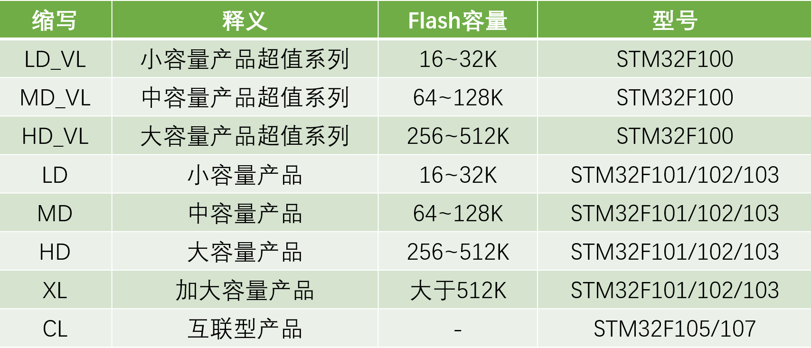
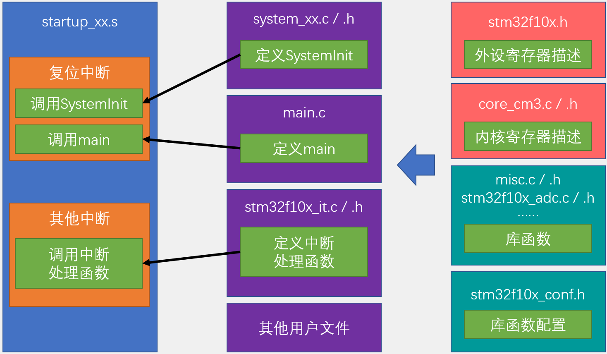

# STM32工程创建指南

## 目录
- [STM32工程创建指南](#stm32工程创建指南)
  - [目录](#目录)
  - [一、STM32开发方式对比](#一stm32开发方式对比)
  - [二、工程创建步骤](#二工程创建步骤)
    - [1. 基础工程创建](#1-基础工程创建)
    - [2. 详细文件夹结构](#2-详细文件夹结构)
    - [3. 必要文件添加](#3-必要文件添加)
    - [4. Keil工程配置](#4-keil工程配置)
    - [5. 调试器配置](#5-调试器配置)
  - [三、编程对比说明](#三编程对比说明)
    - [1. 寄存器编程方式](#1-寄存器编程方式)
      - [基本步骤](#基本步骤)
      - [特点分析](#特点分析)
    - [2. 库函数编程方式](#2-库函数编程方式)
      - [基本步骤](#基本步骤-1)
      - [特点分析](#特点分析-1)
    - [3. 开发建议](#3-开发建议)
    - [4. 开发流程](#4-开发流程)
  - [四、工程结构说明](#四工程结构说明)
    - [1. 程序执行流程](#1-程序执行流程)
    - [2. 文件功能说明](#2-文件功能说明)
  - [五、注意事项](#五注意事项)


## 一、STM32开发方式对比
1. **基于寄存器方式**
   - 直接配置寄存器
   - 类似51单片机开发
   - 效率最高但较复杂
   - 不推荐使用

2. **基于标准库(库函数)方式**
   - 使用ST官方封装函数
   - 本课程采用此方式
   - 开发效率与底层控制平衡
   - 推荐学习使用

3. **基于HAL库方式**
   - 图形化配置
   - 快速上手
   - 隐藏底层细节
   - 建议后期了解

## 二、工程创建步骤

### 1. 基础工程创建
创建工程文件夹(如：STM32Project) -> Keil MDK里新建工程 -> 选择芯片型号(STM32F103C8) -> 关闭工程向导


### 2. 详细文件夹结构
```
STM32Project/
├── Start/                      # 启动和系统文件
│   ├── startup_stm32f10x_md.s  # 启动文件，包含中断向量表和程序入口
│   ├── core_cm3.c             # Cortex-M3内核功能实现
│   ├── core_cm3.h             # 内核寄存器定义和内核功能声明
│   ├── stm32f10x.h            # STM32外设寄存器映射和中断定义
│   ├── system_stm32f10x.c     # 系统时钟配置实现
│   └── system_stm32f10x.h     # 系统初始化函数声明
│
├── Library/                    # 标准库文件(外设驱动)
│   ├── misc.c/h               # NVIC中断控制器和系统配置
│   ├── stm32f10x_adc.c/h      # ADC模数转换
│   ├── stm32f10x_bkp.c/h      # BKP备份寄存器
│   ├── stm32f10x_can.c/h      # CAN总线通信
│   ├── stm32f10x_cec.c/h      # HDMI-CEC通信
│   ├── stm32f10x_crc.c/h      # CRC校验
│   ├── stm32f10x_dac.c/h      # DAC数模转换
│   ├── stm32f10x_dbgmcu.c/h   # DEBUG调试
│   ├── stm32f10x_dma.c/h      # DMA直接内存访问
│   ├── stm32f10x_exti.c/h     # EXTI外部中断/事件
│   ├── stm32f10x_flash.c/h    # FLASH闪存控制
│   ├── stm32f10x_fsmc.c/h     # FSMC外部存储器控制
│   ├── stm32f10x_gpio.c/h     # GPIO通用输入输出
│   ├── stm32f10x_i2c.c/h      # I2C通信
│   ├── stm32f10x_iwdg.c/h     # IWDG独立看门狗
│   ├── stm32f10x_pwr.c/h      # PWR电源控制
│   ├── stm32f10x_rcc.c/h      # RCC时钟控制
│   ├── stm32f10x_rtc.c/h      # RTC实时时钟
│   ├── stm32f10x_sdio.c/h     # SDIO接口
│   ├── stm32f10x_spi.c/h      # SPI通信
│   ├── stm32f10x_tim.c/h      # TIM定时器
│   ├── stm32f10x_usart.c/h    # USART串口通信
│   └── stm32f10x_wwdg.c/h     # WWDG窗口看门狗
│
├── User/                       # 用户代码
│   ├── main.c                 # 主程序入口
│   ├── stm32f10x_conf.h       # 库函数配置文件
│   ├── stm32f10x_it.c         # 中断服务函数
│   └── stm32f10x_it.h         # 中断服务函数声明
│
├── DebugConfig/               # 调试配置文件
│   └── Target_1_STM32F103C8.dbgconf  # ST-Link调试配置
│
├── Listings/                  # 编译信息
│   ├── startup_stm32f10x_md.lst  # 启动文件编译信息
│   └── project.map              # 工程映射信息
│
└── Objects/                   # 编译输出
    ├── *.o                    # 目标文件
    ├── *.d                    # 依赖文件
    ├── *.crf                  # 交叉引用文件
    └── project.axf           # 可执行文件
```

**说明：**
1. Start目录包含系统级的基础文件，决定了程序如何启动和运行
2. Library目录包含所有外设的驱动库，按需调用
3. User目录存放开发者的应用代码
4. DebugConfig/Listings/Objects是工具生成的目录，不需要手动修改，上传github已忽略这部分文件

### 3. 必要文件添加
1. **启动文件** (复制到Start/)
   - 选择对应型号启动文件(xxx_md.s)
  
 **这里因为使用的是64KFlash的STM32F103C8T6型号芯片，所以选择stm32f10x_md.s启动文件**
   
1. **系统文件** (复制到Start/)
   - stm32f10x.h
   - system_stm32f10x.c/h
   - core_cm3.c/h

2. **库函数文件** (复制到Library/)
   - 所有.c文件
   - 所有.h文件

3. **用户配置文件** (复制到User/)
   - stm32f10x_conf.h
   - stm32f10x_it.c/h

### 4. Keil工程配置
1. **创建组并添加文件**
   ```
   - Start组：添加Start/下文件
   - Library组：添加Library/下文件
   - User组：添加User/下文件
   ```

2. **配置包含路径**
   ```
   Project -> Options -> C/C++ -> Include Paths:
   添加./Start
   添加./Library
   添加./User
   ```

3. **添加宏定义**
   ```
   Project -> Options -> C/C++ -> Define:
   添加  USE_STDPERIPH_DRIVER
   ```

### 5. 调试器配置
```
Project -> Options -> Debug:
- 选择ST-Link Debugger
- Settings -> Flash Download勾选Reset and Run
```


## 三、编程对比说明

### 1. 寄存器编程方式

#### 基本步骤
1. **时钟使能**
   ```c
   // filepath: User/main.c
   // 1. 查找RCC_APB2ENR寄存器
   // 2. 确认IOPCEN位(位4)为1，其他位保持0
   RCC->APB2ENR = 0x00000010;  // 使能GPIOC时钟
   ```

2. **GPIO模式配置**
   ```c
   // 1. 查找GPIOx_CRH寄存器
   // 2. 配置CNF13[1:0]=00(推挽输出)
   // 3. 配置MODE13[1:0]=11(50MHz)
   GPIOC->CRH = 0x00300000;    // PC13配置为推挽输出
   ```

3. **GPIO输出控制**
   ```c
   // 操作GPIOx_ODR寄存器的ODR13位
   GPIOC->ODR = 0x00000000;    // PC13输出低电平(LED亮)
   GPIOC->ODR = 0x00002000;    // PC13输出高电平(LED灭)
   ```

#### 特点分析
- **优点**
  - 代码执行效率最高
  - 程序体积小
  - 直接操作硬件

- **缺点**
  - 需要频繁查阅手册
  - 寄存器位操作易出错
  - 代码可读性差
  - 会影响其他位的设置

### 2. 库函数编程方式
需要大量阅读库函数，了解有哪些函数可以调用、函数的功能、参数定义、引用方式、结构体定义、枚举类型结构体中不同名称的含义等

#### 基本步骤
1. **包含头文件**
   ```c
   // filepath: User/main.c
   #include "stm32f10x.h"
   ```

2. **时钟使能**
   ```c
   RCC_APB2PeriphClockCmd(RCC_APB2Periph_GPIOC, ENABLE);
   ```

3. **GPIO初始化**
   ```c
   GPIO_InitTypeDef GPIO_InitStructure;
   
   // 配置结构体参数
   GPIO_InitStructure.GPIO_Pin = GPIO_Pin_13;
   GPIO_InitStructure.GPIO_Mode = GPIO_Mode_Out_PP;
   GPIO_InitStructure.GPIO_Speed = GPIO_Speed_50MHz;
   
   // 初始化GPIO
   GPIO_Init(GPIOC, &GPIO_InitStructure);
   ```

4. **GPIO控制**
   ```c
   GPIO_SetBits(GPIOC, GPIO_Pin_13);      // LED灭
   GPIO_ResetBits(GPIOC, GPIO_Pin_13);    // LED亮
   ```

#### 特点分析
- **优点**
  - 代码可读性好
  - 函数参数提示
  - 不易出错
  - 不影响其他位设置
  - 有完整API文档

- **缺点**
  - 代码量较大
  - 执行效率稍低
  - 需要了解库函数结构

### 3. 开发建议
1. **初学者**
   - 使用库函数方式
   - 关注功能实现
   - 养成查看函数定义习惯

2. **进阶开发**
   - 理解寄存器原理
   - 学习库函数源码
   - 掌握两种开发方式

3. **实际应用**
   - 常规开发用库函数
   - 性能优化用寄存器
   - 灵活结合两种方式

### 4. 开发流程
1. **寄存器方式**
   - 查阅参考手册
   - 计算寄存器值
   - 编写寄存器操作代码
   - 注意位操作影响

2. **库函数方式**
   - 查找对应库函数
   - 查看函数参数说明
   - 配置初始化结构体
   - 调用库函数API

## 四、工程结构说明

### 1. 程序执行流程
1. **启动文件**
   - 定义中断向量表
   - 包含复位中断(程序入口)
   - 调用SystemInit和main

2. **系统初始化**
   - SystemInit配置时钟等
   - 初始化Flash接口
   - 配置系统核心时钟

### 2. 文件功能说明
1. **核心文件**
   - stm32f10x.h：外设寄存器描述
   - core_cm3：内核寄存器描述

2. **库函数文件**
   - 各外设库函数实现
   - 提供标准化API

3. **配置文件**
   - stm32f10x_conf.h：库函数配置
   - stm32f10x_it：中断函数定义

## 五、注意事项
1. 所有文件复制到工程目录内
2. 添加所有头文件路径
3. 确保添加USE_STDPERIPH_DRIVER宏定义
4. 选择正确的启动文件
5. 保持代码结构清晰模块化