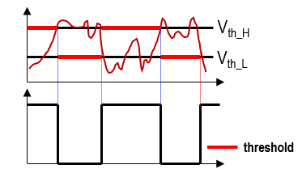

# STM32 GPIO 学习笔记

## 目录
- [STM32 GPIO 学习笔记](#stm32-gpio-学习笔记)
  - [目录](#目录)
  - [GPIO简介](#gpio简介)
  - [GPIO基本结构](#gpio基本结构)
  - [GPIO位结构详解](#gpio位结构详解)
    - [输入路径 (从引脚到内核)](#输入路径-从引脚到内核)
    - [输出路径 (从内核到引脚)](#输出路径-从内核到引脚)
  - [GPIO工作模式](#gpio工作模式)
  - [外部设备与电路](#外部设备与电路)
    - [LED (发光二极管)](#led-发光二极管)
    - [蜂鸣器](#蜂鸣器)
  - [面包板使用简介](#面包板使用简介)

## GPIO简介

*   **GPIO**：**G**eneral **P**urpose **I**nput/**O**utput（通用输入输出接口）的缩写。

*   **电平**：
    *   0V 代表低电平 (0)
    *   3.3V 代表高电平 (1)
    *   部分标注 **FT** (Five Volts Tolerate) 的引脚可**容忍**5V输入，但输出仍为3.3V。
*   **输出模式应用**：
    *   驱动LED、蜂鸣器
    *   控制大功率设备（需外加驱动电路）
    *   模拟通信协议（如I2C, SPI）的时序
*   **输入模式应用**：
    *   读取按键状态
    *   读取数字传感器模块信号
    *   ADC电压采集（需配置为模拟输入）
    *   模拟通信协议接收数据

## GPIO基本结构

*   **挂载总线**：所有GPIO外设均挂载在 **APB2** 总线上。
*   **命名规则**：GPIOx (x = A, B, C...)，每个GPIO有16个引脚 (0-15)。
    *   例如：GPIOA的第0个引脚 = PA0
[Image: GPIO模块框图，展示寄存器、驱动器和引脚]
*   **核心部件**：
    *   **寄存器**：内核通过APB2总线读写寄存器来控制GPIO。
        *   **输出数据寄存器 (ODR)**：写 `1` -> 高电平，写 `0` -> 低电平。
        *   **输入数据寄存器 (IDR)**：读 `1` -> 高电平，读 `0` -> 低电平。
        *   STM32寄存器为32位，但**GPIO只使用低16位**。
    *   **驱动器**：增强信号的驱动能力。

## GPIO位结构详解

一个GPIO引脚内部的电路结构可分为**输入路径**和**输出路径**。

### 输入路径 (从引脚到内核)
1.  **保护二极管**：钳制输入电压，防止过压/欠压损坏内部电路。
    *   电压 > 3.3V -> 上方二极管导通 -> 电流流向VDD
    *   电压 < 0V -> 下方二极管导通 -> 电流从VSS流出
    *   电压在0V~3.3V之间 -> 二极管不工作
2.  **上拉/下拉电阻**：可通过软件配置，避免引脚悬空时电平不确定。
    *   **上拉输入**：默认高电平
    *   **下拉输入**：默认低电平
    *   **浮空输入**：电平完全由外部信号决定，悬空时易受干扰
    *   
3.  **施密特触发器 (Schmitt Trigger)**：对输入波形进行整形，消除抖动，将模拟电压转换为稳定的数字信号。

1.  **输入数据寄存器 (IDR)**：CPU读取此寄存器获取引脚电平。
2.  **其他输入路径**：
    *   **模拟输入**：绕过施密特触发器，直接接入ADC。
    *   
    *   **复用功能输入**：从施密特触发器后接入其他外设（如USART）。

### 输出路径 (从内核到引脚)
1.  **数据源选择**：
    *   **输出数据寄存器 (ODR)**：普通GPIO输出。
    *   **外设**：复用功能输出（如PWM, USART）。
2.  **输出控制**：
    *   **位设置/清除寄存器 (BSRR)**：可**原子操作**某一位，不影响其他位。
        *   `BSRR`低16位写 `1` -> 对应位置 `1` (Set)
        *   `BSRR`高16位写 `1` -> 对应位置 `0` (Reset)
    *   (也可通过读-改-写ODR或位带操作实现，但BSRR更高效安全)
3.  **输出驱动器 (MOS管)**：
    *   **推挽输出 (Push-Pull)**：
        *   `1` -> **P-MOS**导通，输出高电平(3.3V)
        *   `0` -> **N-MOS**导通，输出低电平(0V)
        *   **高低电平都具有强驱动能力**。

    *   

    *   **开漏输出 (Open-Drain)**：
        *   `1` -> N-MOS也断开，输出高阻态（无驱动能力）
        *   `0` -> N-MOS导通，输出低电平(0V)
        *   **特点**：需外部上拉电阻才能输出高电平；可实现"线与"功能；可兼容5V设备。
    *   **复用开漏-推挽输出**：
        *   

## GPIO工作模式

通过配置端口配置寄存器，可将GPIO设置为8种模式：

| 模式 | 简称 | 特征与应用 |
| :--- | :--- | :--- |
| **GPIO_Mode_AIN** | 模拟输入 | GPIO无效，引脚直接接入内部ADC，用于ADC采集 |
| **GPIO_Mode_IN_FLOATING** | 浮空输入 | 电平完全由外部输入决定，必须接驱动源，切忌悬空 |
| **GPIO_Mode_IPU** | 上拉输入 | 内部上拉电阻有效，默认高电平 |
| **GPIO_Mode_IPD** | 下拉输入 | 内部下拉电阻有效，默认低电平 |
| **GPIO_Mode_Out_OD** | 开漏输出 | 高电平为高阻态，低电平接地。可用于通信总线(如I2C)或电平转换 |
| **GPIO_Mode_Out_PP** | 推挽输出 | 强推输出，高低电平均有强驱动能力。最常用的输出模式 |
| **GPIO_Mode_AF_OD** | 复用开漏 | 输出信号源于片上外设，输出特性同开漏输出 |
| **GPIO_Mode_AF_PP** | 复用推挽 | 输出信号源于片上外设，输出特性同推挽输出 |

**注意**：除了**模拟输入**模式会关闭所有数字电路功能外，其他7种模式下**输入路径始终有效**，均可读取IDR。

## 外部设备与电路

### LED (发光二极管)
*   **特性**：单向导电，正负极区分（长正短负，内部小正大负）。
*   **驱动电路**：
    *   **低电平驱动**：LED正极接VCC(3.3V)，负极串限流电阻接GPIO。`GPIO=0`点亮，`GPIO=1`熄灭。**推荐此接法**。
    *   
    *   **高电平驱动**：LED负极接GND，正极串限流电阻接GPIO。`GPIO=1`点亮，`GPIO=0`熄灭。       
    *   
*   **限流电阻**：**必须串联**，防止LED过流烧毁或调节亮度。

### 蜂鸣器
*   **有源蜂鸣器**：内部带振荡源，给定直流电压即响，频率固定。**本教程使用**。
    *   **驱动**：通常低电平触发。可使用三极管开关电路驱动（如S8050 NPN三极管，基极高电平导通）。
    *   **PNP三极管的驱动电路**
        *   三极管的左边是基极，带箭头的是发射极，剩下的是集电极
        *   左边的基极给低电平，三极管就会导通
        *   通过3.3V和GND，就可以给蜂鸣器提供驱动电流了
        *   基极给高电平，三极管截止，蜂鸣器就没有电流
        *   
    *   **NPN三极管的驱动电路**
        *   三极管的左边是基极，带箭头的是发射极，剩下的是集电极
        *   左边的基极给高电平，三极管就会导通
        *   
    *   PNP的三极管最好接在上边，NPN的三极管最好接在下边，因为三极管的通断，是需要在发射极和基极直接产生一定的开启电压的，如果把负载接在发射极这边，可能会导致三极管不能开启

*   **无源蜂鸣器**：内部无振荡源，需外部提供PWM脉冲驱动，可通过改变频率发出不同音调。

## 面包板使用简介

*   **内部结构**：
    *   **中间区域**：纵向5个孔为一组，内部连通。
    *   **上下电源轨**：通常标有`+`/`-`，横向一整排孔内部连通（注意有些面包板中间是断开的，需用跳线连接）。

*   **使用方法**：
    1.  将电源正负极分别接入上下电源轨。
    2.  元件引脚插入孔中，依靠内部金属爪连接。
    3.  同一组的孔位是连通的，可用于连接元件。
    4.  使用跳线（杜邦线）在电源轨和元件组之间建立连接。

